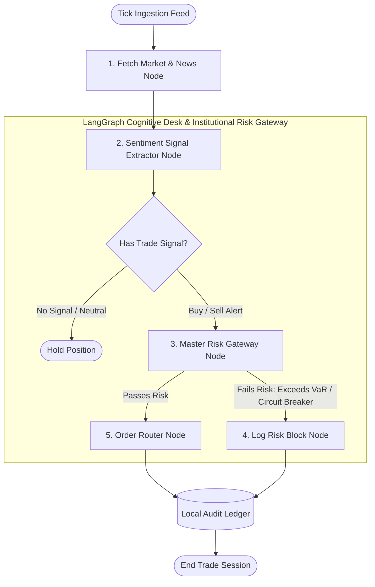

# FinGenAI Masterclass: Large Language Models & Institutional Risk Management 📈🤖📉

[](https://python.org)
[](https://jupyter.org)
[](https://github.com/langchain-ai/langgraph)
[](https://github.com/chroma-core/chroma)
[](https://deepmind.google/technologies/gemini/)

Welcome to the **FinGenAI Masterclass**! This repository is an institutional-grade, step-by-step educational laboratory demonstrating how to build and deploy advanced Generative AI architectures, multi-agent pipelines, stateful trading logic, and **world-class quantitative risk management frameworks** within investing applications.

Structured as five comprehensive, production-ready Jupyter Notebooks backed by a standalone Python core risk package (`risk_management`), this course navigates from fundamental data pipelines up to designing an autonomous execution agent and institutional risk control engine.

---

## 📁 Curriculum Syllabus

| Module Notebook | Core Technical Focus | Key Financial Application |
| :--- | :--- | :--- |
| **`01_Financial_Data_Acquisition.ipynb`** | Asynchronous APIs, `yfinance`, live streaming feeds, HTML structure cleaning. | Ingesting real-time stock ticks, historical price frames, SEC regulatory feeds, and raw news. |
| **`02_Financial_RAG_System.ipynb`** | Parent-child text segmentation, dense vector embeddings, ChromaDB, metadata filters. | Ingesting 100+ page SEC 10-K filings to perform citation-backed financial audits and risk discovery. |
| **`03_Sentiment_Signal_Extraction.ipynb`** | Few-shot prompting, JSON output constraints, Pydantic validator classes. | Converting unstructured market news feeds into structured numerical trading sentiment signals. |
| **`04_Autonomous_execution_Agent.ipynb`** | Cyclic LangGraph orchestration, pre-trade risk checkpoints, state storage. | Building an autonomous trading agent that reads market data, runs risk checks, and executes simulated orders. |
| **`05_Institutional_Risk_Management.ipynb`** | VaR/CVaR, Kelly Criterion, Circuit Breakers, L-VaR, Hierarchical Risk Parity. | Institutional capital allocation, fat-tail risk modeling, dynamic volatility targeting, and macro shock stress testing. |

---

## 🛡️ 5 World-Class Quantitative Risk Management Frameworks

This repository includes a standalone, production-ready Python package `risk_management/` featuring 5 institutional risk management engines:

```
risk_management/
├── __init__.py                 # Public API exports
├── var_cvar.py                 # 1. VaR & Expected Shortfall (Parametric, Student-t, FHS, MC, EVT-GPD)
├── kelly_sizing.py             # 2. Kelly Criterion (Bernoulli, Merton Jump-Diffusion, Constrained Multi-Asset)
├── drawdown_vol_target.py      # 3. Dynamic Volatility Targeting & Drawdown Circuit Breakers
├── liquidity_stress_regime.py  # 4. Liquidity-Adjusted VaR (L-VaR) & Macro Shock Stress Testing
├── hrp_risk_parity.py          # 5. Hierarchical Risk Parity (HRP) & Covariance Shrinkage
└── engine.py                   # Master Institutional Risk Manager Gateway
```

### 1. Value at Risk (VaR) & Expected Shortfall (CVaR) Engine
Computes multi-methodology tail loss estimates across 6 quantitative formulations:
- **Parametric Gaussian VaR/CVaR**:
  $$\text{VaR}_{\alpha} = - (\mu \cdot h + z_{\alpha} \cdot \sigma \cdot \sqrt{h}) \cdot \text{Portfolio Value}$$
- **Student-t Fat-Tailed VaR**: Adjusts for kurtosis and heavy tails.
- **Filtered Historical Simulation (FHS-EWMA)**: Volatility-scaled empirical quantile loss.
- **Monte Carlo Cholesky Simulation**: Simulates correlated multi-asset returns.
- **Extreme Value Theory (EVT-GPD)**: Fits Generalized Pareto Distribution to tail losses exceeding threshold $u$:
  $$\text{VaR}_{\alpha,\text{GPD}} = u + \frac{\beta}{\xi} \left[ \left( \frac{N}{N_u} (1 - \alpha) \right)^{-\xi} - 1 \right]$$

### 2. Kelly Criterion & Optimal Capital Allocation Engine
Determines optimal position sizing to maximize long-term logarithmic wealth growth:
- **Continuous-Time Log-Normal Kelly**: $f^* = \frac{\mu - r}{\sigma^2}$
- **Merton Jump-Diffusion Crash-Adjusted Kelly**: Accounts for sudden crash intensity $\lambda$ and jump size $j$:
  $$\max_f \left\{ f (\mu - r - \lambda j) - \frac{1}{2} f^2 \sigma^2 + \lambda \log(1 + f j) \right\}$$
- **Fractional Kelly & Constrained Multi-Asset Optimizer**: Solves $\mathbf{w}^* = \mathbf{\Sigma}^{-1}\boldsymbol{\mu}$ subject to leverage & weight bounds.

### 3. Dynamic Drawdown Control & Volatility Targeting Engine
- **Target Volatility Allocation**: Dynamically scales portfolio leverage to maintain constant annualized volatility $\sigma_{target}$:
  $$\text{Leverage Scalar} = \min\left( \frac{\sigma_{target}}{\sigma_{realized}}, L_{max} \right)$$
- **Maximum Drawdown Circuit Breakers**: Finite state machine transitioning between `NORMAL`, `WARNING`, `DELEVERAGING`, `HARD_HALT`, and `RECOVERY` states.
- **Chandelier ATR Trailing Stop**: Volatility-based exit floor locking in peak profits.

### 4. Liquidity-Adjusted VaR (L-VaR) & Macro Stress Testing Engine
- **L-VaR Model**: Incorporates bid-ask spread variance and exogenous liquidation horizon $T_{liq}$:
  $$\text{L-VaR} = \text{VaR}_{base} + \frac{1}{2} P_0 (\mu_{spread} + z_{\alpha} \sigma_{spread}) \sqrt{T_{liq}}$$
- **Regime-Aware Risk Adjustments**: Dynamically scales exposure based on volatility regime detection.
- **Macro Crash Stress Testing**: Replays historical shock matrices (GFC 2008 Lehman, 2020 COVID shock, 2010 Flash Crash, 2022 Fed Rate Hikes).

### 5. Hierarchical Risk Parity (HRP) & Covariance Shrinkage Engine
- **Ledoit-Wolf & OAS Covariance Shrinkage**: Stabilizes noisy sample covariance matrices:
  $$\mathbf{\Sigma}_{shrunk} = (1 - \delta) \mathbf{\Sigma}_{sample} + \delta \mathbf{F}_{prior}$$
- **Marcos López de Prado's HRP**: Uses angular distance $d_{ij} = \sqrt{\frac{1}{2}(1 - \rho_{ij})}$, Single-Linkage Clustering, Quasi-Diagonalization, and Top-Down Recursive Bisection to eliminate covariance matrix inversion instability.
- **Equal Risk Contribution (ERC / Risk Parity)**: Equalizes marginal risk contributions across assets.

---

## 📐 Autonomous Agentic Order Routing (Module 4 & 5)



---

## ⚙️ Quick Start Installation & Unit Testing

### 1. Clone & Enter Repository
```bash
git clone https://github.com/Rishav-raj-github/FinGenAI.git
cd FinGenAI
```

### 2. Setup Local Environment Variables
Create a localized `.env` file in the root folder:
```bash
echo GOOGLE_API_KEY="your_actual_gemini_api_key_here" > .env
```

### 3. Install Technical Dependencies
```bash
python -m venv venv
# On Windows:
venv\Scripts\activate
# On Linux/macOS:
source venv/bin/activate

pip install -r requirements.txt
```

### 4. Run Risk Management Unit Test Suite
Verify numerical accuracy across all 5 risk management modules:
```bash
python -m unittest test_risk_management.py
```

### 5. Boot Jupyter Lab
```bash
jupyter lab
```
Open **`05_Institutional_Risk_Management.ipynb`** to explore the quantitative risk masterclass!

---

## 🛠️ Developer Technical Stack
* **Language**: Python 3.10+
* **Quantitative & Risk Stack**: `numpy`, `scipy`, `pandas`, `yfinance`, `matplotlib`, `seaborn`
* **Vector Engine**: `chromadb` (configured for persistent local disk storage)
* **Agentic Orchestration**: `langchain`, `langgraph`
* **LLM Model Suite**: `gemini-2.0-flash`
